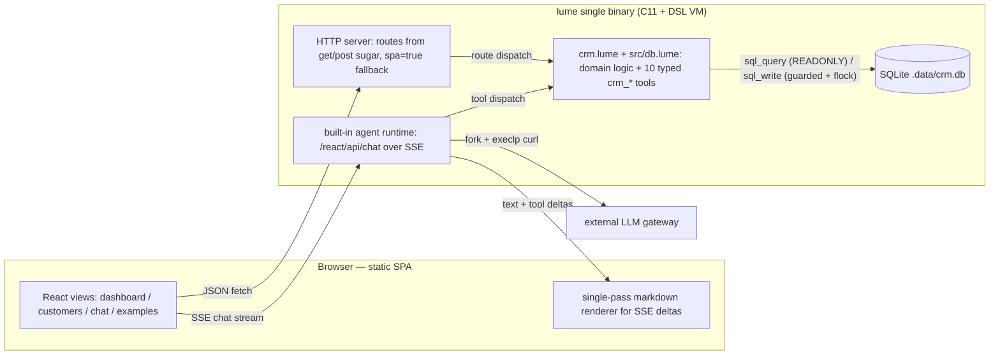
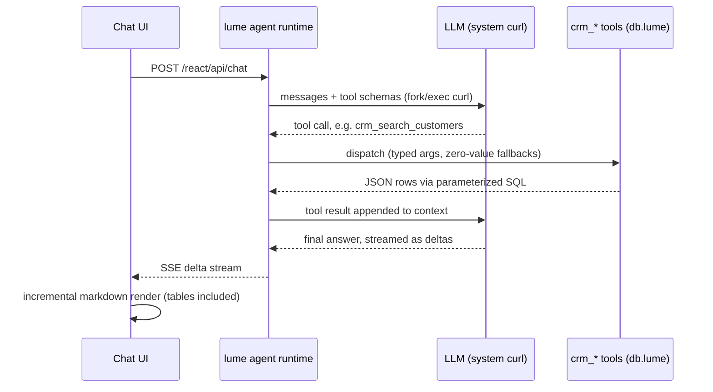

# Architecture

English · companion to [README.md](README.md) / [README.zh.md](README.zh.md)

> README covers *what* this project is and *how to run it*. This document covers
> *how the pieces fit*: the request topology, the agent tool-calling loop, how the
> read-only flag propagates through every layer, and the deployment shapes. It is
> intentionally short — the data-layer rationale lives in README
> ("Data-layer design"); the read-only A/B verification results are inline in
> README's Docker notes.

## The big picture

One process, one binary, one script. The C11 `lume` binary hosts the HTTP server,
a VM that runs the `.lume` scripts, SQLite, and the built-in agent runtime. The
frontend is a static React bundle served from the docroot — there is no Node
service, no ORM, no background jobs anywhere.

Two traffic classes, cleanly separated:

- **JSON API** — `fetch` from the SPA into `get`/`post` routes. GET paths open
  SQLite in `SQLITE_OPEN_READONLY` mode and never touch the lock; write paths
  take the application-level flock (the SQLite C side sets no `busy_timeout`,
  so concurrent worker writes are serialized here).
- **Agent chat** — `POST /react/api/chat` is framework-native: the agent runtime
  streams SSE deltas to the browser and dispatches tool calls back into the same
  `.lume` domain layer the REST API uses. One set of business rules, two doors.

## The agent loop

Design notes:

- **Typed tools, generated schemas** — each `tool` declaration in `db.lume`
  produces a typed JSON schema for the model; missing keys fall back to
  zero values (empty string / zero = "leave that field unchanged"), so the
  model cannot partially clobber a row by omitting fields.
- **LLM transport is `curl`** — the runtime forks and `execlp`s the system curl
  (`agent-httpd/src/agent/agent.c`). DNS is resolved by musl curl via Docker's
  embedded DNS, so `host.docker.internal:<port>` gateways work inside
  containers. `curl` is a hard dependency (explicitly installed in the image).
- **Streaming-friendly rendering** — deltas arrive token by token, so the
  frontend markdown renderer is a zero-dependency, single-pass scanner (fenced
  code, headings, lists, quotes, inline styles, and pipe tables); no tree
  parsing, no re-render of the whole message.
- **Offline fallback** — no `LLM_API_URL`/`LLM_API_KEY` configured means chat
  falls back to a built-in demo engine; the CRM core itself is fully local and
  needs no network.

## Read-only mode: one flag, four layers

`LUME_CRM_READONLY=1` (compose default, used by the public demo) propagates
through every layer — this is what makes an unauthenticated public demo safe:

| Layer | Mechanism | Effect |
|---|---|---|
| Agent tool registry (`db.lume`) | the 8 write tools are **never registered** | prompt injection has no destructive surface to call — nothing to jailbreak |
| REST API (`crm.lume`) | every write endpoint 403s | curl-level abuse hits a wall |
| Native tools (container entrypoint) | `HARNESS_TOOLS_ALLOW` trimmed | chat agent loses `read_file`/`fetch_url` — no file-read or outbound channels |
| Frontend (`chat.tsx`) | `LOCAL` hostname check | query-only quick prompts / greeting / subtitle on public; write-type entries appear only on localhost dev |

Verified A/B: writable + injected "delete the
customer" → really deletes; read-only + same injection → agent has no delete
tool to call, data intact. `/discovery` self-publishes the readonly flag and
the (trimmed) tool list, so the security story is visible on the page itself.

## Deployment shapes

| Shape | Command | Bind | Writes | LLM |
|---|---|---|---|---|
| Local dev | `make` / `make crm-dev` | `127.0.0.1` (default) | full | `.env` key or offline engine |
| Container | `docker run -d -p 8089:8089 -e LUME_BIND=0.0.0.0 …` | `0.0.0.0` inside, `-p` maps it | full | `-e`/mounted `.env`, or offline |
| Public demo | `docker compose up` (`LUME_CRM_READONLY=1`) | `0.0.0.0` behind reverse proxy (TLS) | **off** (four layers above) | gateway via compose env |

Image facts that make this cheap: lume ≥ v0.5.1 ships a `*-static` binary
(libsqlite3 + libc baked in, ~10MB alpine image, no runtime deps), the image
contains no `.env` (`.dockerignore` + explicit `COPY .env.example` only), and
container config precedence is `-e` / compose env > mounted `/app/.env` >
framework defaults (details in README, Docker section).

## Deliberately absent

- **No Node runtime** — React SSR exists in lume (`server{ react_socket }`) but
  is intentionally unused here; a resident node process would break the
  "single binary" story. The one SSR page (`/share/customer`) uses the
  framework's C-side `el/html` components — zero JS, auto-escaped slots.
- **No ORM / no migrations framework** — `CREATE TABLE IF NOT EXISTS` + a
  first-run seed; the business dictionary (`deal_stages` / `closed_stages` /
  `default_stage`) is the single source of truth for stage semantics.
- **No auth by default** — the server binds loopback in dev; the public shape
  relies on the read-only flag instead of credentials (lume's global Basic
  Auth gate remains available as defense in depth).
